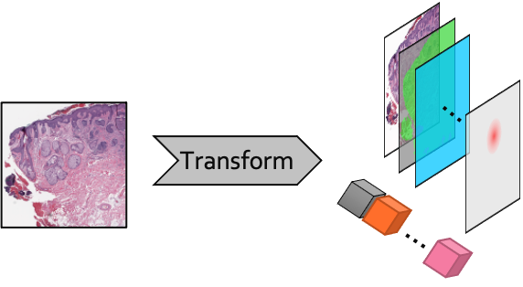
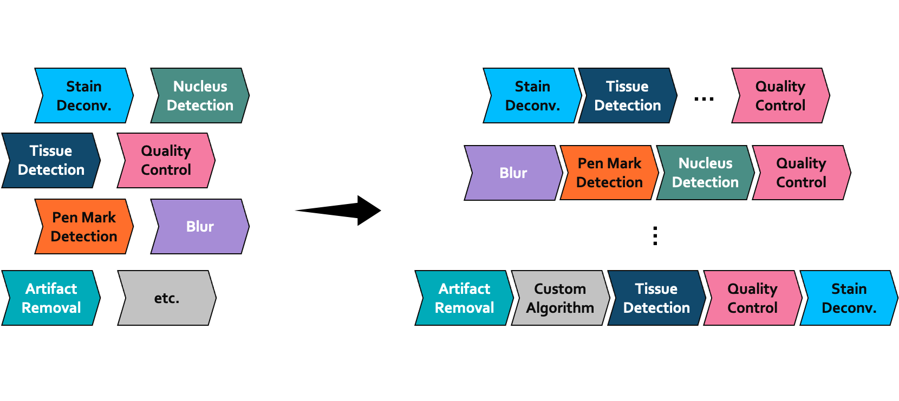

Creating Preprocessing Pipelines
================================

Preprocessing pipelines define how raw images are transformed and prepared for downstream analysis.
The ``pathml.preprocessing`` module provides tools to define modular preprocessing pipelines for whole-slide images.

In this section we will walk through how to define a
:class:`~pathml.preprocessing.pipeline.Pipeline` object by composing pre-made
:class:`~pathml.preprocessing.transforms.Transform` objects, and how to implement a
new custom :class:`~pathml.preprocessing.transforms.Transform`.

What is a Transform?
--------------------

The :class:`~pathml.preprocessing.transforms.Transform` is the building block for creating preprocessing pipelines.
Each :class:`~pathml.preprocessing.transforms.Transform` contains an operation which,
when applied to a :class:`~pathml.core.tile.Tile` object, modifies it in some way.
For example, a :class:`~pathml.preprocessing.transforms.Transform` may modify the image (e.g. apply a blur),
create/modify a mask (e.g. tissue detection), or create/modify a label (e.g. binary classification whether the
tile contains any pen marks).

    Schematic diagram of a :class:`~pathml.preprocessing.transforms.Transform` operating on a tile.
    In this example, several masks are created (represented by stacked rectangles) as well as
    several labels (depicted here as cubes).

What is a Pipeline?
-----------------------

A preprocessing pipeline is a set of independent operations applied sequentially.
In ``PathML``, :class:`~pathml.preprocessing.pipeline.Pipeline` s are defined as a sequence of
:class:`~pathml.preprocessing.transforms.Transform` objects. This makes it easy to compose a custom
:class:`~pathml.preprocessing.pipeline.Pipeline` by mixing-and-matching:

    Schematic diagram of :class:`~pathml.preprocessing.pipeline.Pipeline` composition from a set of modular components

In practice, this requires only a few lines of code:

.. code-block::

    from pathml.preprocessing.pipeline import Pipeline
    from pathml.preprocessing.transforms import BoxBlur, TissueDetectionHE

    pipeline = Pipeline([
        BoxBlur(kernel_size=15),
        TissueDetectionHE(mask_name = "tissue", min_region_size=500,
                          threshold=30, outer_contours_only=True)
    ])

In this example, the preprocessing pipeline will first apply a box blur kernel, and then apply tissue detection.
It is that easy to compose pipelines by mixing and matching :class:`~pathml.preprocessing.transforms.Transform` objects!

Premade pipelines
--------------------

Pre-made Pipelines make it even easier to get up-and-running quickly.

+--------------------------------------------+------------------------------------------------------------------------+
| Pipeline name                              | Description                                                            |
+============================================+========================================================================+
| DefaultHEPipeline                          | Divides input wsi into tiles. Does not apply any tile-level processing.|
+--------------------------------------------+------------------------------------------------------------------------+

[implement a few default pipelines, and add here with links in the left column]

Creating custom Transforms
------------------------------

.. note:: For advanced users

In some cases, you may want to implement a custom :class:`~pathml.preprocessing.transforms.Transform`.
For example, you may want to apply a transformation which is not already implemented in ``PathML``.
Or, perhaps you want to create a new transformation which combines several others.

To define a new custom :class:`~pathml.preprocessing.transforms.Transform`,
all you need to do is create a class which inherits from :class:`~pathml.preprocessing.transforms.Transform` and
implements an ``apply()`` method which takes a :class:`~pathml.core.tile.Tile` as an argument and modifies it in place.
You may also implement a functional method ``F()``, although that is not strictly required.

For example, let's take a look at how :class:`~pathml.preprocessing.transforms.BoxBlur` is implemented:

.. code-block:: python

    class BoxBlur(Transform):
        """Box (average) blur kernel."""
        def __init__(self, kernel_size=5):
            self.kernel_size = kernel_size

        def F(self, image):
            return cv2.boxFilter(image, ksize = (self.kernel_size, self.kernel_size), ddepth = -1)

        def apply(self, tile):
            tile.image = self.F(tile.image)

That's it! Once you define your custom :class:`~pathml.preprocessing.transforms.Transform`,
you can plug it in with any of the other :class:`~pathml.preprocessing.transforms.Transform`s,
compose :class:`~pathml.preprocessing.pipeline.Pipeline`, etc.
