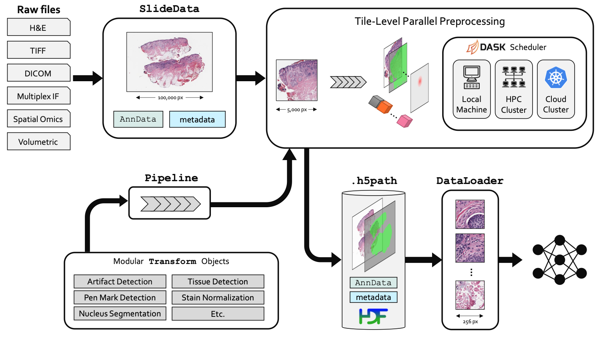

Welcome to PathML's documentation!
==================================

``PathML`` is a Python package for computational pathology.

``PathML`` is a toolbox to facilitate machine learning workflows for high-resolution whole-slide pathology
images. This includes modular pipelines for preprocessing, PyTorch DataLoaders for training and benchmarking
machine learning model performance on standardized datasets, and support for sharing preprocessing pipelines,
pretrained models, and more.

Development is a collaboration between the AI Operations and Data Science Group in the Department of Informatics
and Analytics at Dana-Farber Cancer Institute and the Department of Pathology and Laboratory Medicine at Weill
Cornell Medicine.

.. toctree::
   :maxdepth: 2
   :caption: Getting Started

   overview
   installation

.. toctree::
   :maxdepth: 2
   :caption: Preprocessing

   loading_slides
   creating_pipelines
   running_pipelines
   h5path

.. toctree::
   :maxdepth: 2
   :caption: Datasets

   datasets

.. toctree::
   :maxdepth: 2
   :caption: Machine Learning

   dataloaders
   models

.. toctree::
   :maxdepth: 2
   :caption: Examples

   examples/link_stain_normalization
   examples/link_preprocessing_pipeline
   examples/link_multiplex_if
   examples/link_codex
   examples/link_train_hovernet
   examples/link_gallery

.. toctree::
   :maxdepth: 2
   :caption: API Reference

   api_core_reference
   api_preprocessing_reference
   api_datasets_reference
   api_ml_reference
   api_utils_reference

.. toctree::
   :maxdepth: 2
   :caption: Contributing

   link_contributing

Indices and tables
==================

* :ref:`genindex`
* :ref:`search`
