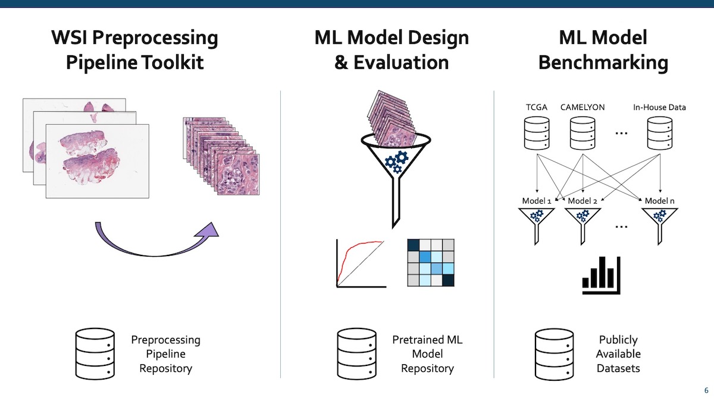

Overview
========

``PathML`` is a toolkit supporting each step in the computational pathology researchers workflow:

By providing these tools, we aim to accelerate research, reduce barriers to entry for new researchers, and promote open science.

.. note::
    We provide pre-built tools, public datasets, and documentation to allow anyone with beginner proficiency in python to
    get started.

For advanced users, we provide a modular set of tools which can be composed into custom workflows, as well as complete
API documentation to enable implementation of new features or tools on top of PathML.

Whether you want to get started quickly with pre-built tools and tutorials,
of if you want to mix-and-match components to design your own analysis pipelines,
or if you want to dig into the code and write completely custom extensions and new features -
``PathML`` has something for you!
