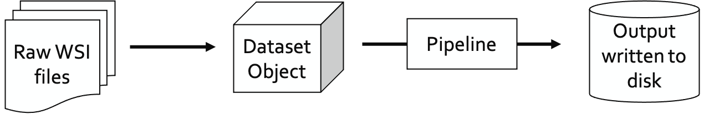

Preprocessing Quickstart
========================

Preprocessing pipelines define how raw images are transformed and prepared to be fed as inputs into models.
The ``pathml.preprocessing`` module provides tools for defining preprocessing pipelines for whole-slide images.

Getting started with premade pipelines
--------------------------------------

The general preprocessing workflow is:

PathML comes with preprocessing pipelines ready to use out of the box.
Get started by loading a WSI from disk and running a default preprocessing pipeline in 5 lines of code:

.. code-block::

    from pathml.preprocessing.wsi import HESlide
    from pathml.preprocessing.pipelines import DefaultHEPipeline

    wsi = HESlide("/path/to/slide.svs")
    pipeline = DefaultTilingPipeline()
    pipeline.run(wsi, output_dir = "/path/to/output/dir")

Pipelines can also be run on entire datasets, with no change to the code:

.. code-block::

    from pathml.datasets import PESO
    from pathml.preprocessing.pipelines import DefaultTilingPipeline

    peso = PESO(data_dir = "/path/to/data/", download = True)
    pipeline = DefaultTilingPipeline()
    pipeline.run(peso, output_dir = "/path/to/output/dir")

When running a pipeline on a dataset, ``PathML`` will use multiprocessing by default to distribute the workload to
all available cores. This allows users to efficiently process large datasets by scaling up computational resources
(local cluster, cloud machines, etc.) without needing to make any changes to the code.

Currently available premade pipelines
-------------------------------------

+--------------------------------------------+------------------------------------------------------------------------+
| Pipeline name                              | Description                                                            |
+============================================+========================================================================+
| DefaultHEPipeline                          | Divides input wsi into tiles. Does not apply any tile-level processing.|
+--------------------------------------------+------------------------------------------------------------------------+

[implement a few more default pipelines, and add here with links in the left column]

Supported file formats
----------------------

Whole-slide images can come in a variety of file formats, depending on the type of image and the scanner used.
``PathML`` has several backends for loading images, enabling support for a wide variety of data formats.

============ ==========================================================================================================
Backend      Supported file types
============ ==========================================================================================================
OpenSlide    ``.svs``, ``.tif``, ``.tiff``, ``.bif``, ``.ndpi``, ``.vms``, ``.vmu``, ``.scn``, ``.mrxs``, ``.svslide``

             `Complete list of file types supported by OpenSlide <https://openslide.org/formats/>`_

DICOM        ``.dcm``

Bio-Formats  Multiparametric and volumetric TIFF files

             `Complete list of file types supported by Bio-Formats
             <https://docs.openmicroscopy.org/bio-formats/latest/supported-formats.html>`_
============ ==========================================================================================================
