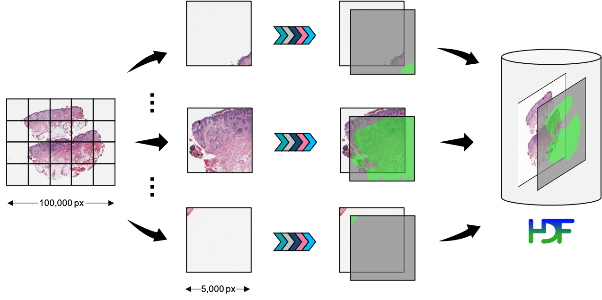

Running Preprocessing Pipelines
===============================

How it works
------------

Whole-slide images are typically too large to load in memory, and computational requirements scale poorly in image size.
``PathML`` therefore runs preprocessing on smaller regions of the image which can be held in RAM,
and then aggregates the results at the end.

Preprocessing pipelines are defined in :class:`~pathml.preprocessing.pipeline.Pipeline` objects.
When :meth:`SlideData.run() <pathml.core.slide_data.SlideData.run>`
is called, :class:`~pathml.core.tile.Tile` objects are lazily extracted from the slide by the
:meth:`SlideData.generate_tiles() <pathml.core.slide_data.SlideData.generate_tiles>` method and passed to the
:meth:`Pipeline.apply() <pathml.preprocessing.pipeline.Pipeline>` method, which modifies the tiles in place.
Finally, all processed tiles are aggregated into a single ``h5py.Dataset`` array and a PyTorch Dataset is generated.

Each tile is processed independently, and this data-parallel design makes it easy to utilize computational resources
and scale up to large datasets of gigapixel-scale whole-slide images.

    Schematic diagram of running a preprocessing pipeline. Tiles are extracted from the WSI and processed
    in parallel, before finally being aggregated into a HDF5 file on disk.

Preprocessing a single WSI
--------------------------

Get started by loading a WSI from disk and running a preprocessing pipeline:

.. code-block::

    from pathml.core import HESlide
    from pathml.preprocessing import Pipeline, BoxBlur, TissueDetectionHE

    wsi = HESlide("../data/CMU-1.svs", name = "example")

    pipeline = Pipeline([
        BoxBlur(kernel_size=15),
        TissueDetectionHE(mask_name = "tissue", min_region_size=500,
                          threshold=30, outer_contours_only=True)
    ])

    wsi.run(pipeline)

Preprocessing a dataset of WSI
------------------------------

Pipelines can also be run on entire datasets, with no change to the code:
Here we create a mock :class:`~pathml.core.slide_dataset.SlideDataset` and run the same pipeline as above:

.. code-block::

    from pathml.core import HESlide, SlideDataset
    from pathml.preprocessing import Pipeline, BoxBlur, TissueDetectionHE

    # create demo dataset
    n = 10
    slide_list = [HESlide("../data/CMU-1.svs", name = "example") for _ in range(10)]
    slide_dataset = SlideDataset(slide_list)

    pipeline = Pipeline([
        BoxBlur(kernel_size=15),
        TissueDetectionHE(mask_name = "tissue", min_region_size=500,
                          threshold=30, outer_contours_only=True)
    ])

    slide_dataset.run(pipeline)

Distributed processing
----------------------

When running a pipeline, ``PathML`` will use multiprocessing by default to distribute the workload to
all available cores. This allows users to efficiently process large datasets by scaling up computational resources
(local cluster, cloud machines, etc.) without needing to make any changes to the code. It also makes it feasible to run
preprocessing pipelines on less powerful machines, e.g. laptops for quick prototyping.

We use dask.distributed_ as the backend for multiprocessing. Jobs are submitted to a ``Client``, which takes care of
sending them to available resources and collecting the results. By default, ``PathML`` creates a `local cluster`_.
Several libraries exist for creating ``Clients`` on different systems, e.g.:

* dask-kubernetes_ for kubernetes
* dask-jobqueue_ for common job queuing systems including PBS, Slurm, MOAB, SGE, LSF, and HTCondor
  typically found in high performance supercomputers, academic research institutions, etc.
* dask-yarn_ for Hadoop YARN clusters

To take full advantage of available computational resources, users must initialize the appropriate ``Client``
object for their system and pass it as an argument to the ``SlideData.run()`` or ``SlideDataset.run()``.
Please refer to the Dask documentation linked above for complete information on creating the ``Client``
object to suit your needs.

.. _dask-yarn: https://yarn.dask.org/
.. _dask.distributed: https://distributed.dask.org/
.. _dask-jobqueue: https://jobqueue.dask.org/
.. _dask-kubernetes: https://kubernetes.dask.org/
.. _local cluster: https://distributed.dask.org/en/latest/api.html#distributed.LocalCluster
